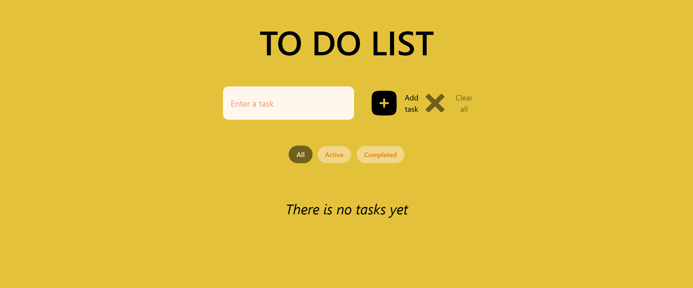
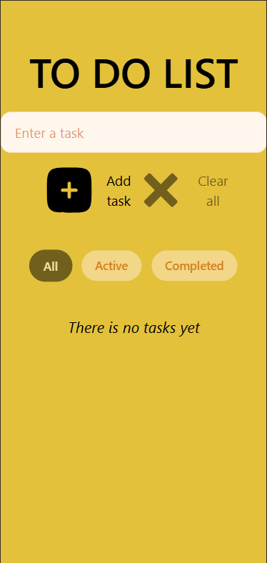

# To Do App (React + Tailwind)

# Screenshots




A simple and responsive To Do application built with **React** and **Tailwind CSS**.

**Live demo:** https://german900-code.github.io/To-Do-App-React-Tailwind/

---

## 🚀 Features

- ➕ Add new tasks

- ✅ Mark tasks as completed

- 🗑 Delete single task

- 🧹 Clear all tasks with confirmation

- 🔍 Filter tasks (All / Active / Completed)

- 💾 Save tasks and filter state to `localStorage`

- 📱 Fully responsive (mobile, tablet, desktop)

- 🎬 Smooth animations for adding/removing tasks

---

- **React** (hooks)
- **Tailwind CSS**
- **JavaScript (ES6+)**
- **GitHub Pages** (deployment, code review)
- **Vite**

---

## 📂 Project Structure

src/
├── components/
│ ├── Button.jsx
│ ├── List.jsx
│ └── Filter.jsx
├── assets/
│ └── icons/...
├── App.jsx
└── main.jsx

---

## ⚙️ How it works

- Tasks are stored as objects with `id`, `text` and `isChecked`
- Application state is managed with React `useState`
- Data is persisted using `localStorage`
- Filtering is done dynamically based on task status
- UI is styled using utility classes from Tailwind CSS

---

## 📦 Installation & Run locally

```bash
git clone https://github.com/german900-code/To-Do-App-React-Tailwind.git
cd To-Do-App-React-Tailwind
npm install
npm run dev
```

**🌍 Deployment**

The project is deployed using GitHub Pages via the gh-pages branch.

**👤 Author**

German Voloshyn
Junior Frontend Developer
GitHub: https://github.com/german900-code

**📌 Notes**

This project was created for learning purposes to practice:

React component architecture

State management

Responsive layout

Working with Git and GitHub
